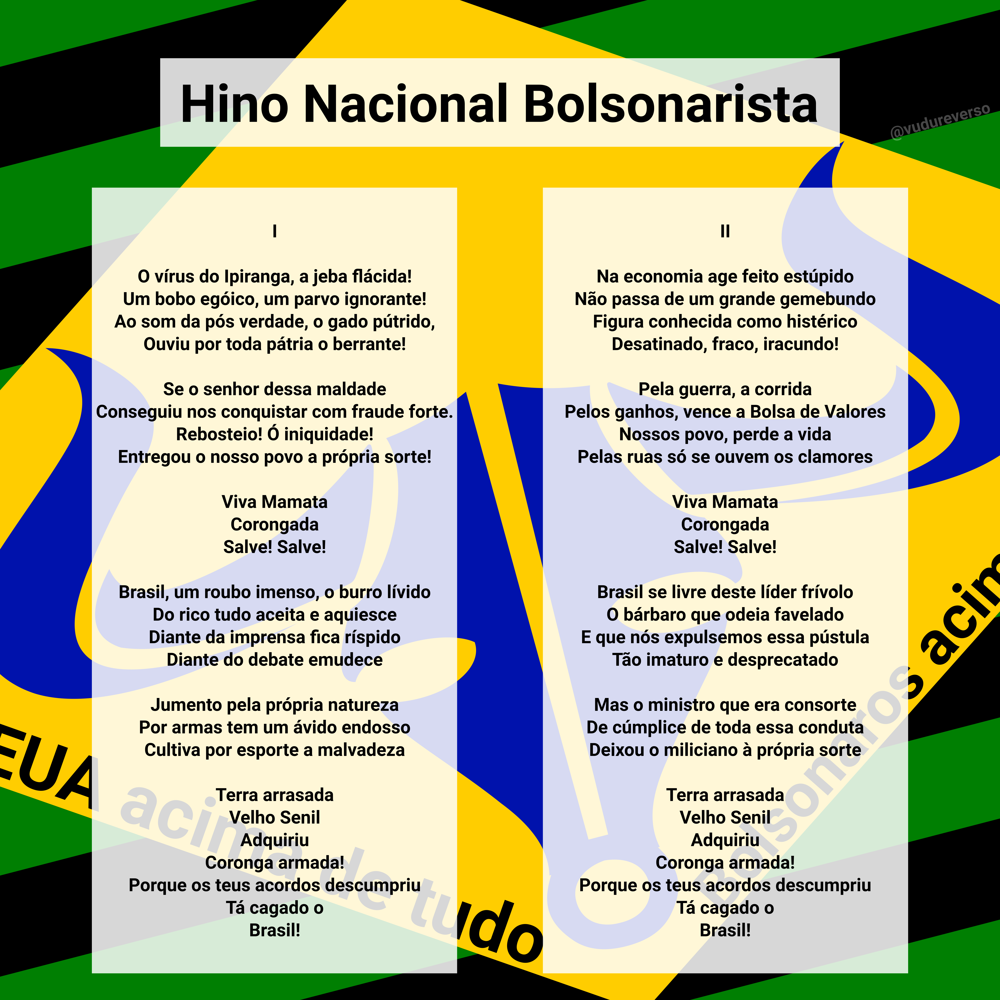
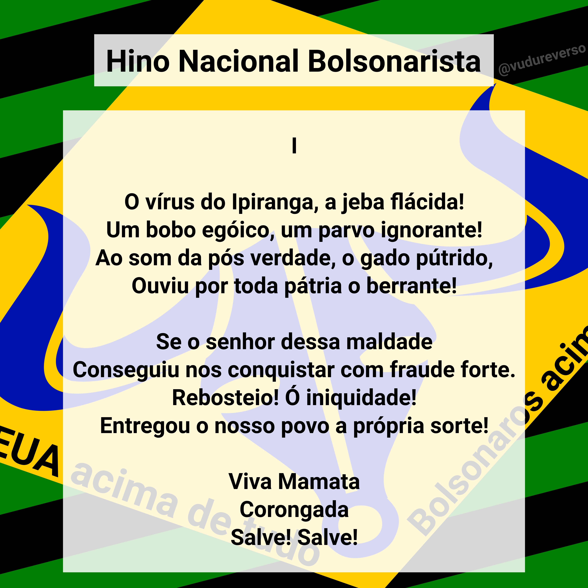
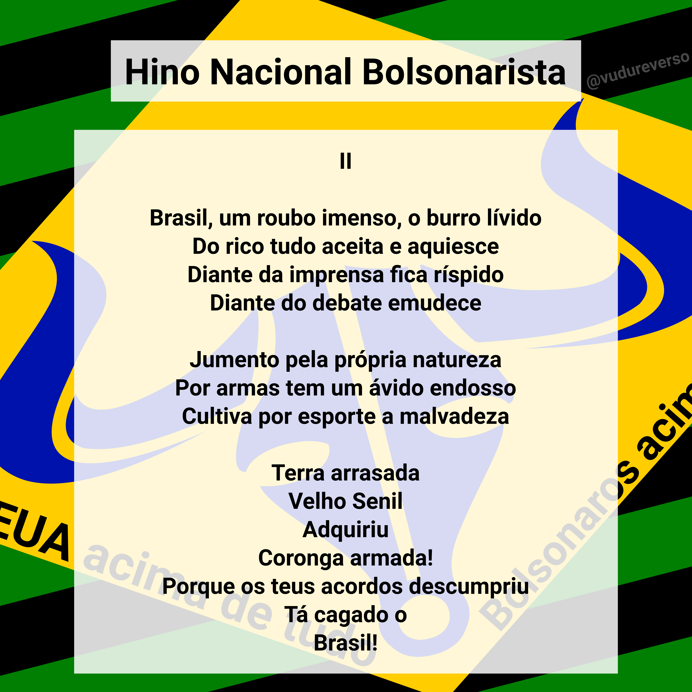
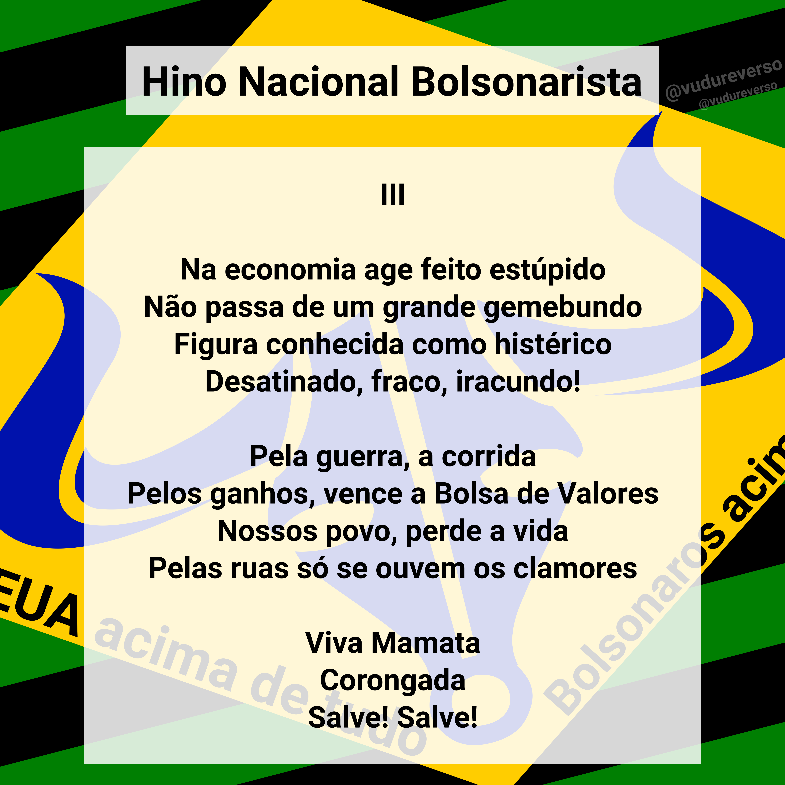
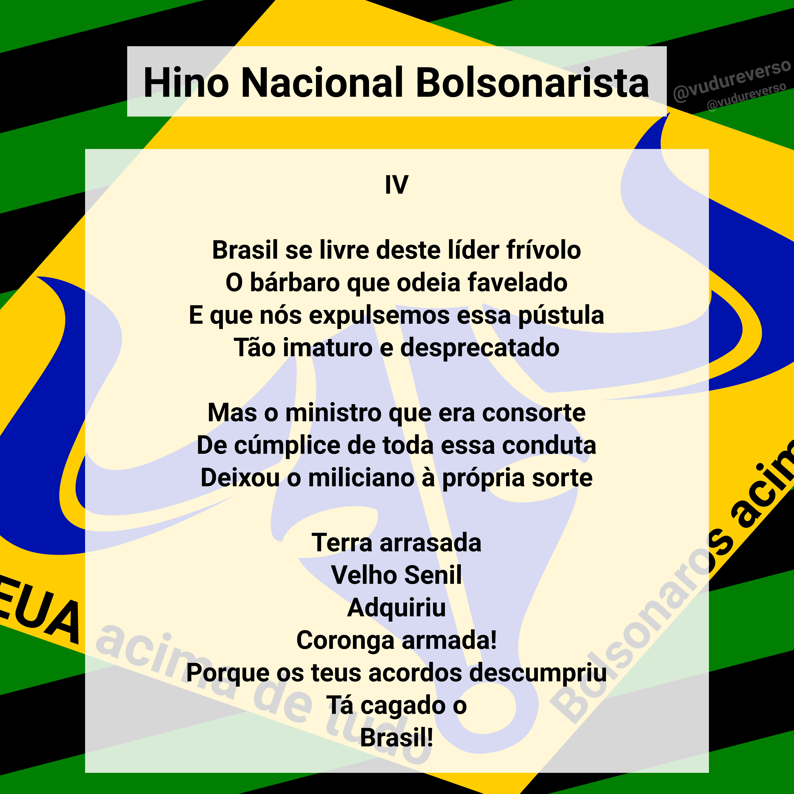

# Hino Nacional Bolsonarista

Autor: Vudu reverso

## I

> O vírus do Ipiranga, a jeba flácida!  
> Um bobo egóico, um parvo ignorante!  
> Ao som da pós verdade, o gado pútrido,  
> Ouviu por toda pátria o berrante!  
<!-- -->  
> Se o senhor dessa maldade  
> Conseguiu nos conquistar com fraude forte.  
> Rebosteio! Ó iniquidade!  
> Entregou o nosso povo a própria sorte!  
<!-- -->  
> Viva Mamata  
> Corongada  
> Salve! Salve!  
<!-- -->  
> Brasil, um roubo imenso, o burro lívido  
> Do rico tudo aceita e aquiesce  
> Diante da imprensa fica ríspido  
> Diante do debate emudece  
<!-- -->  
> Jumento pela própria natureza  
> Por armas tem um ávido endosso  
> Cultiva por esporte a malvadeza  
<!-- -->  
> Terra arrasada  
> Velho Senil  
> Adquiriu  
> Coronga armada!  
> Porque os teus acordos descumpriu  
> Tá cagado o  
> Brasil!  
  
## II  
  
> Na economia age feito estúpido  
> Não passa de um grande gemebundo  
> Figura conhecida como histérico  
> Desatinado, fraco, iracundo!  
<!-- -->  
> Pela guerra, a corrida  
> Pelos ganhos, vence a Bolsa de Valores  
> Nossos povo, perde a vida  
> Pelas ruas só se ouvem os clamores  
<!-- -->  
> Viva Mamata  
> Corongada  
> Salve! Salve!  
<!-- -->  
> Brasil se livre deste líder frívolo  
> O bárbaro que odeia favelado  
> E que nós expulsemos essa pústula  
> Tão imaturo e desprecatado  
<!-- -->  
> Mas o ministro que era consorte  
> De cúmplice de toda essa conduta  
> Deixou o miliciano à própria sorte  
<!-- -->  
> Terra arrasada  
> Velho Senil  
> Adquiriu  
> Coronga armada!  
> Porque os teus acordos descumpriu  
> Tá cagado o  
> Brasil!  

## Imagens para compartilhar

### Hino completo

### Hino dividido

Para compartilhar no Instagram

